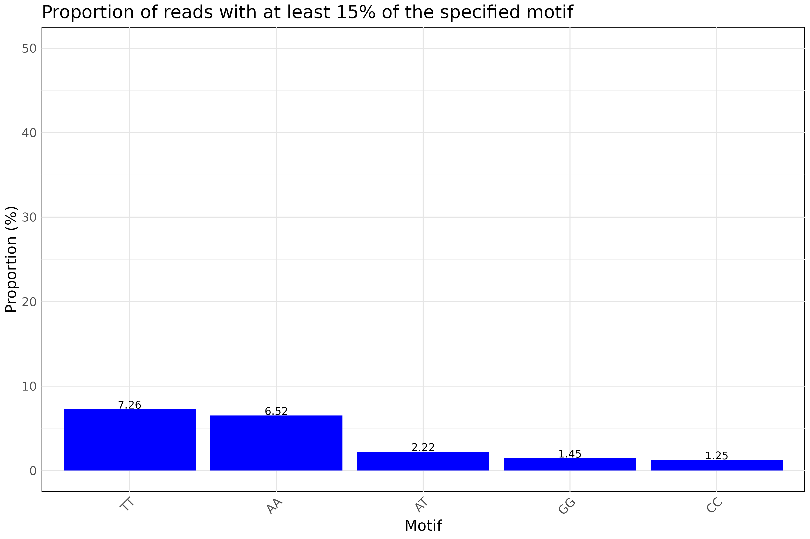

# Freq-Motif-FASTQ

`freq-motif-fastq` is a command-line tool written in Rust to analyze FASTQ files and generate statistics on dinucleotides, trinucleotides and low-complexity bases. 
It supports both short and long reads and outputs results in CSV and PNG formats.

## Features

- Analyze FASTQ files (including gzip compressed files).
- Generate statistics on motifs and low-complexity bases.
- Output results as a CSV file and a PNG histogram.
- Customizable options for maximum reads, ratio, and skipping initial reads.

## Installation

To install `freq-motif-fastq`, follow these steps:

1. **Clone the repository:**

   ```bash
   git clone https://github.com/yourusername/freq-motif-fastq.git
   cd freq-motif-fastq

2. **Build the project using Cargo:**

   ```bash
   cargo build --release

This will create an executable in the target/release directory.

## Usage
To use freq-motif-fastq, run the following command with the desired options:

   ```bash
   ./target/release/freq-motif-fastq [OPTIONS] --input <INPUT>

   Options
   -i, --input <INPUT>          : Input FASTQ file (supports gzip).
   -o, --output-dir <OUTPUT_DIR>: Output directory to save results
                                  (default: unique directory in current directory).
   -m, --max-reads <MAX_READS>  : Maximum number of reads to analyze (default: 100,000).
   -r, --ratio <RATIO>          : Minimum proportion to consider (in percentage).
                                  Changing this value will affect the readability of the output graph (default: 15).
   -S, --skip <SKIP>            : Number of initial reads to skip (default: 10,000).
   -h, --help                   : Print help information.

   Additional Information:
   Could be short- or long-reads, but only the first 150 base pairs of each read will be used.
   If a read is longer than 1,000 base pairs, the 150 base pairs between positions 850 and 1,000 will be used instead.
  ```

## Example
   ```bash
   ./target/release/freq-motif-fastq --input sample.fastq.gz --output-dir results
   ```

## Expected Output

1. CSV File: A CSV file containing the statistics on motifs and low-complexity bases will be saved in the specified output directory.

   ```bash
   ## head results/freq-motif.csv
   Motif,Proportion
   TT,7.2560
   AA,6.5180
   AT,2.2200
   GG,1.4500
   CC,1.2510
   TA,0.9860
   TG,0.6520
   CA,0.5070
   CT,0.4840
   ```

2. PNG File: A histogram (histogram.png) showing the frequency of low-complexity, dinucleotides, and trinucleotides will also be saved in the output directory.



## License
This project is licensed under the CeCILL License - see the [LICENSE file](http://www.cecill.info/licences/Licence_CeCILL_V2.1-en.html) for details.
